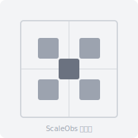

# ScaleObs

**服务器运维观测与 AI 编程代理管理面板**

ScaleObs 是一个自托管的运维门户，通过 [Headscale](https://headscale.net/) 自动发现服务器节点，用轻量级 Agent 采集指标，在统一面板展示 CPU、内存、磁盘、网络、Docker 容器以及各节点上运行的编程 AI 代理（OpenCode、Codex、Claude Code 等）。


---

## 定位

ScaleObs **不是**来替代 Grafana / Portainer / Prometheus 的，而是**站在它们前面。**

```
                    ┌──────────────────┐
                    │    ScaleObs      │  ← 第一眼：所有服务器一目了然
                    │  "At a glance"   │
                    └──────┬───────────┘
                           │
            ┌──────────────┼──────────────┐
            │              │              │
     ┌──────▼─────┐ ┌─────▼──────┐ ┌─────▼──────┐
     │  Grafana   │ │  Portainer │ │ Headscale  │  ← 需要深挖时点进去
     │  指标趋势   │ │ 容器管理   │ │ 节点管理   │
     └────────────┘ └────────────┘ └────────────┘
```

### 其他工具解决不了的问题

| 问题 | 现有工具 | ScaleObs |
|------|----------|----------|
| "我的 10 台服务器整体状态怎么样？" | Grafana 需要每台配 Prometheus + 手动建面板 | 装一个 agent 就自动出现 |
| "哪些节点在跑 AI 编程 Agent？" | 没有任何工具能回答 | 紫色徽章一眼看见 |
| "新加了一台 Mac Mini 到 Tailscale，我想看到它" | 手动去 Grafana 加 target，去 Portainer 加 endpoint | 自动从 Headscale 同步，直接出现 |
| "我想在一个页面看完所有服务" | 浏览器开 5 个标签页 | 一个页面全看完 |
| "我刚买的 2C4G 小机器装什么监控？" | Prometheus + Grafana 要吃 1GB 内存 | agent 不到 20MB |

### ScaleObs 的真正价值

- **自动发现** — 服务器加入 Tailscale → 自动出现在面板。这是最核心的差异点
- **极轻量** — 一个二进制跑起来就行，0 依赖。适合资源受限的边缘节点
- **AI Agent 感知** — 独有功能，生态里没有替代品
- **统一入口** — 不用在 5 个面板之间来回切，ScaleObs 是第一站
- **配置简单** — 一个 YAML 文件搞定所有

### 什么情况下 ScaleObs 真正有用？

- 你有 **3 台以上机器**，分散在不同地方（家里/云/办公室）
- 你用 **Tailscale** 组网
- 你跑 **AI 编程 Agent**（OpenCode / Codex / Claude Code）
- 你想知道 **"现在一切正常吗"**，而不是去查历史趋势

## 功能特性

- **自动发现** — 从一或多个 Headscale 网络拉取服务器节点列表
- **轻量 Agent** — 部署到每台主机，采集 CPU、内存、磁盘、网络、Docker 容器信息
- **编程代理检测** — 自动检测各主机上运行的 `opencode`、`codex`、`claude code` 进程，在服务器卡片上显示徽章
- **远程 Docker 监控** — 通过 TCP API 轮询远程 Docker 守护进程，将容器信息合并到服务器状态中
- **AI Agent Server 面板** — 显示已检测到的编程代理；可手动添加未连通主机的 Server 条目（支持 Basic Auth）
- **管理面板** — Tauri + Vue 3 桌面应用，包含服务器、网络、AI Agent、服务面板等区块
- **YAML 配置** — 通过设置页在线编辑 `services.yml`，或通过 UI 添加配置项
- **Agent 二进制分发** — 提供 Linux、macOS、Windows 的预编译 Agent 下载

## 架构

```
┌──────────────┐     ┌──────────────┐     ┌──────────────┐
│  Agent(s)    │────▶│  Gateway     │◀────│  Dashboard   │
│  (采集指标)  │WS   │  (Go 服务)   │HTTP │  (Tauri+Vue) │
│              │     │  :8080       │     │  :4173       │
└──────────────┘     └──────┬───────┘     └──────────────┘
                            │
                    ┌───────┴───────┐
                    │  Headscale    │
                    │  API          │
                    │  :8444        │
                    └───────────────┘
```

### 组件说明

| 组件 | 技术栈 | 功能 |
|------|--------|------|
| **Gateway** | Go | 中央服务：API、Agent WebSocket、Headscale 同步、配置管理 |
| **Agent** | Go | 主机指标采集器：CPU、内存、磁盘、Docker、编程代理检测 |
| **Dashboard** | Tauri 2 + Vue 3 + Vite | 桌面 GUI：服务器卡片、网络概览、AI Agent 面板 |
| **Headscale** | 外部服务 | Tailscale 兼容的协调服务器，用于节点发现 |

## 快速开始

### 前置要求

- Go 1.22+
- Node.js 20+ / Bun
- Rust（构建 Tauri 桌面端时需要）
- Headscale 服务器（可选，自动发现用）

### 1. 启动 Gateway

```bash
cd gateway
export CONFIG_PATH=../config/services.yml
export JWT_SECRET=your-secret-key
export ADMIN_USERNAME=admin
export ADMIN_PASSWORD=your-password
export AGENT_TOKEN=agent-secret-token
go run .
```

Gateway 运行在 `http://localhost:8080`。

### 2. 启动 Dashboard（开发模式）

```bash
cd dashboard
bun install
bun run dev          # Vite 开发服务器 :5173
# 或
bun run tauri dev    # Tauri 桌面窗口
```

### 3. 在主机上安装 Agent

从设置页下载 Agent，或直接通过 API 获取：

```bash
# Linux
wget http://your-gateway:8080/api/agent/download/linux/amd64 -O /usr/local/bin/scaleobs-agent
chmod +x /usr/local/bin/scaleobs-agent

export GATEWAY_URL=ws://your-gateway:8080
export SERVER_ID=my-server
export AGENT_TOKEN=agent-secret-token
scaleobs-agent &
```

## 环境变量

| 变量 | 说明 | 默认值 |
|------|------|--------|
| `CONFIG_PATH` | 配置文件路径 | `config/services.yml` |
| `JWT_SECRET` | JWT 签名密钥 | 必填 |
| `ADMIN_USERNAME` | 管理员用户名 | 必填 |
| `ADMIN_PASSWORD` | 管理员密码 | 必填 |
| `AGENT_TOKEN` | Agent 连接令牌 | 必填 |

## 配置说明

编辑 `config/services.yml` 或在 Dashboard 设置页中在线修改。

```yaml
# Headscale 网络（用于自动发现节点）
headscale_networks:
  - name: "primary"
    url: https://headscale.example.com:8444
    api_key: "your-api-key"

# 远程 Docker 守护进程
docker_hosts:
  - name: "server-1"
    host: "100.64.0.4"
    port: 2375

# 按 IP 标注主机上运行的编程代理
host_agents:
  "100.64.0.1": [opencode]
  "100.64.0.4": [codex]

# 手动添加的 AI Agent Server（可在面板中通过 UI 添加）
# agent_servers:
#   - name: "我的 Codex"
#     url: http://192.168.1.100:8080
#     user: "admin"        # Basic Auth 用户名（可选）
#     password: "xxx"      # Basic Auth 密码（可选）
```

## 构建

```bash
# 构建 Agent
cd agent && go build -o scaleobs-agent .

# 构建 Gateway
cd gateway && go build -o scaleobs-gateway .

# 构建 Dashboard（生产模式）
cd dashboard && bun run build
```

## 开发相关

### 项目结构

```
├── agent/            # Agent 采集器
│   ├── collector/    # 指标采集（CPU/内存/磁盘/Docker/代理检测）
│   ├── model/        # 数据结构
│   └── main.go
├── gateway/          # 中央服务
│   ├── api/          # HTTP API 处理器
│   ├── auth/         # JWT 认证
│   ├── config/       # 配置加载
│   ├── model/        # 数据模型
│   └── monitor/      # 服务监控（DockerHub, Headscale 同步）
├── dashboard/        # 前端面板
│   ├── src/          # Vue 3 源码
│   └── src-tauri/    # Tauri 桌面壳
└── config/           # 配置文件
```

### 仪表盘组件

- **GaugeMeter** — 圆形指针仪表盘，用于显示 CPU/内存/磁盘的百分比占用
- **ServerCard** — 服务器卡片，展示指标、Docker 状态、AI 代理徽章
- **TileGrid** — 服务面板磁贴网格
- **NetworkCard** — 网络连接卡片（Headscale、Docker、FRPS 等）

## 社区

欢迎加入 **ScaleObs 微信交流群**，一起讨论运维监控、AI 编程代理管理：

> 群名：ScaleObs3  
> 扫码加入：  
> 

如果二维码已过期，请联系维护者或提交 Issue。

**欢迎 PR！** 任何改进、Bug 修复、功能增强都欢迎提交 Pull Request。

## 许可

MIT
